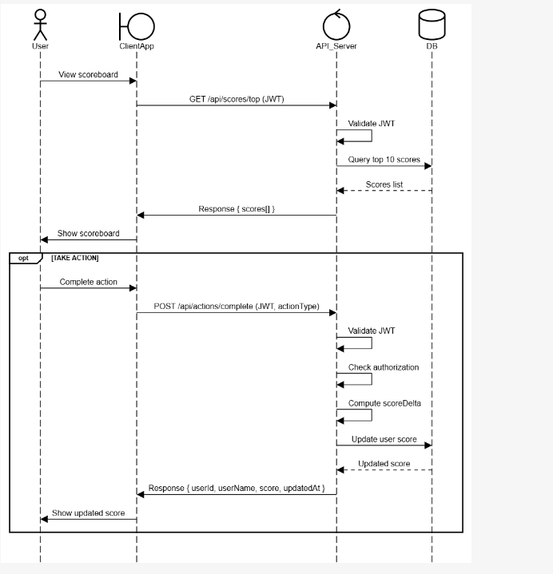

#  Scoreboard Module

# 1. Overview

- The Scoreboard Module provides top 10 users based on their scores, which allows user to update their score after completing actions and making sure that the score board is always live and accurate.

# 2. Actors
-  User: Completes actions to update points and views the score board.    
-  Backend System: Validates score updates, updates the database, and maintains the score board.

# Resource Definition
The resource is `UserScore`

class UserScore
{

  id!: string;        // Unique user ID
  
  userName!: string;  // User name

  actionType: string // actions that use complete
  
  score!: number;     // current score
  
  updatedAt!: Date;   // latest update
  
}

# Functional Requirements

+ User Action : Update a user's score after completing an action.

+ Get Top 10 Users: Fetch top 10 users sorted by score (descending).

+ Live score board Updates: update score board in real time

# Non-Functional Requirements

+ Authorization & Validation: Authenticate user before updating scores

# API ENDPOINT

1. User Action
   
+ Endpoint: POST /api/actions/complete.

+ Description: Updates the user’s score after completing an action.

+ Request:

- Headers: Authorization: Bearer <JWT>

- Body : actionType: string

+ Response (200 OK):
  
{

  "userId": string,
  
  "userName": string,
  
  "score": number
  
  "updatedAt": DATE

}

Error Responses: 401 Unauthorized ,403 Forbidden ,429 Too Many Requests,500 Internal Server Error

2. Get Top 10 Users

Endpoint: GET /api/scores/top

Description: Get top 10 users based their score

Request: NONE

Resonpse: List UserScore

Error Responses: 500 Internal Server Error

3. Live Scoreboard Updates

Endpoint: GET /api/scores/stream

Description: returns a continuous event stream whenever user completed action.

Request:

+ Headers:

Authorization: Bearer <JWT>

Response (Streamed Events):

Status: 200 OK

Content-Type: text/event-stream

# Suggestions

+ Use Redis or in-memory cache for fast leaderboard computation.

+ Implement WebSocket or SSE for real-time updates.

+ Maintain audit logs of score changes for security and analytics.

+ Using JWT or Role-based access control for every request to prevent malicious users.

# Diagram illustrate the flows

