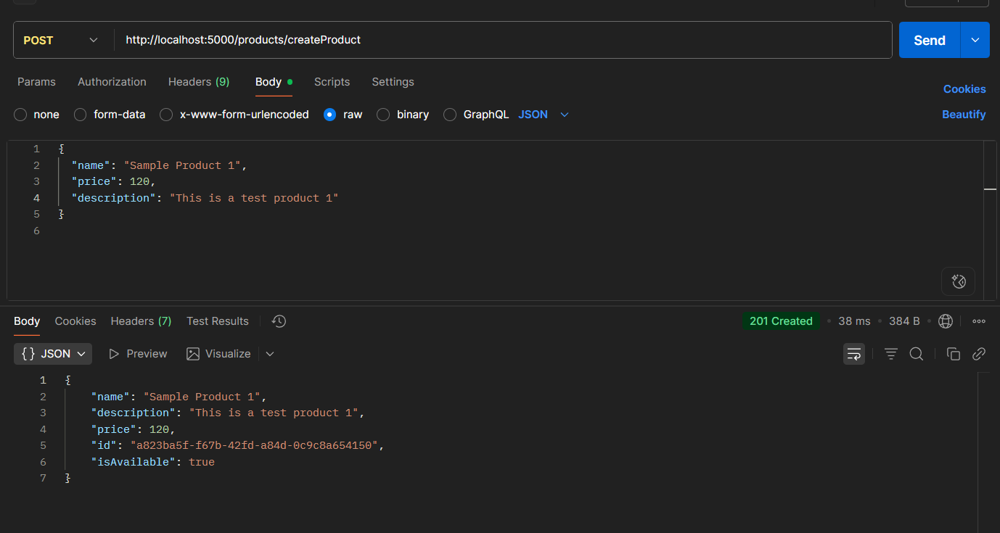

# Problem2

## Overview

Create a CRUD API that allows users to interact with a resource, including creating, reading, updating, deleting, and filtering resource

I defined the resource as a class below:

class product {
    
  id!: string;

  name!: string;
 
  description?: string;

  price!: number;

  isAvailable!: boolean;

}

## Result

## Installation & Setup

### 1. Clone the repository

git clone https://github.com/<your-username>/<your-repo>.git
cd <your-repo>

2. npm install dependencies

3. Create .env file
touch .env

Add the following variables to .env

# Database configuration
DB_HOST=localhost
DB_PORT= your_db_port
DB_USERNAME=root
DB_PASSWORD=your_password
DB_NAME=product_db

# Application configuration
PORT=3000

4. Create MySQL database

Log into MySQL and create the database: CREATE DATABASE product_db;

Running the Application: npm run dev

