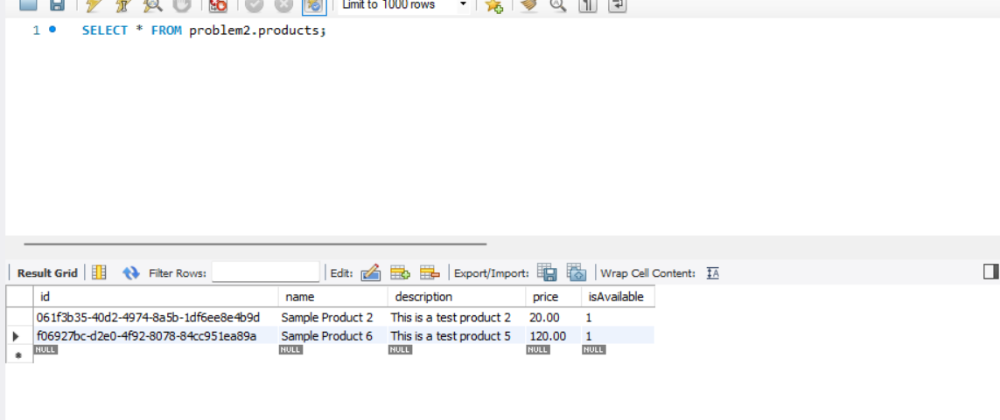
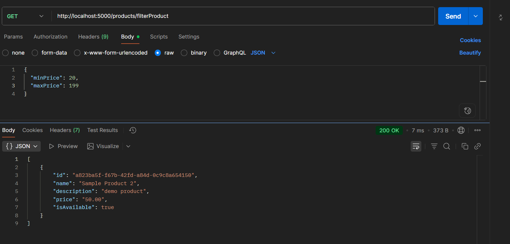
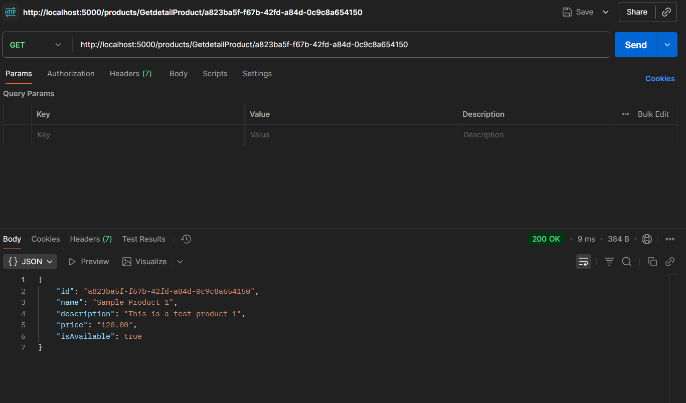
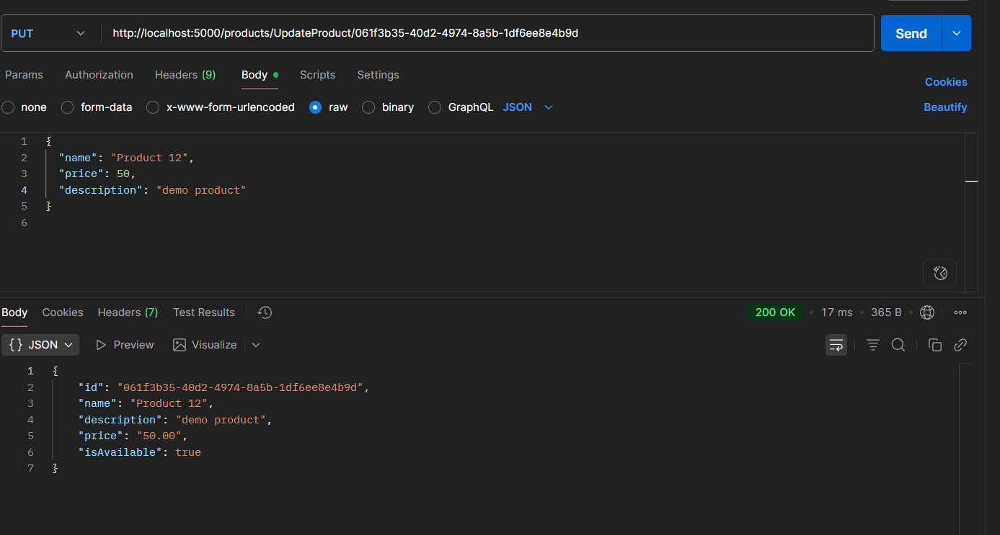
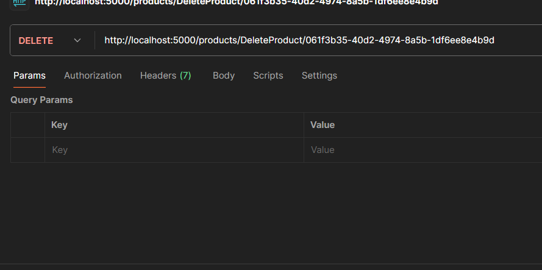

# Problem2

## Overview

Create a CRUD API that allows users to interact with a resource, including creating, reading, updating, deleting, and filtering resource

I defined the resource as a class below:

class product {
    
  id!: string;

  name!: string;
 
  description?: string;

  price!: number;

  isAvailable!: boolean;

}

## Result

+ Create a resource.

+ List resources with basic filters (min_price,max_price)

+ Get details of a resource

+ Update resource details.

+ Delete resource details.

## Installation & Setup

1. Clone the repository

git clone https://github.com/nguyenhuynhphuongloc/99Tech-CodeChallenge.git

2. Create .env file

Add the following variables to .env

3. Database configuration
DB_HOST=localhost

DB_PORT= your_db_port

DB_USERNAME=root

DB_PASSWORD=your_password

DB_NAME=product_db

4. Application configuration
PORT=3000

5. Create MySQL database

Log into MySQL and create the database: CREATE DATABASE product_db;

6. Running the Application: npm run dev in terminal

